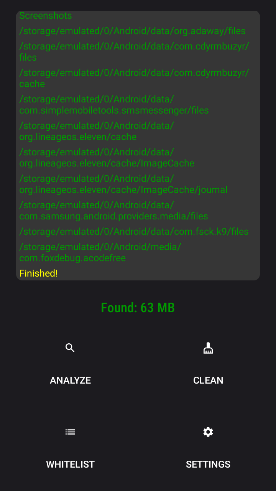
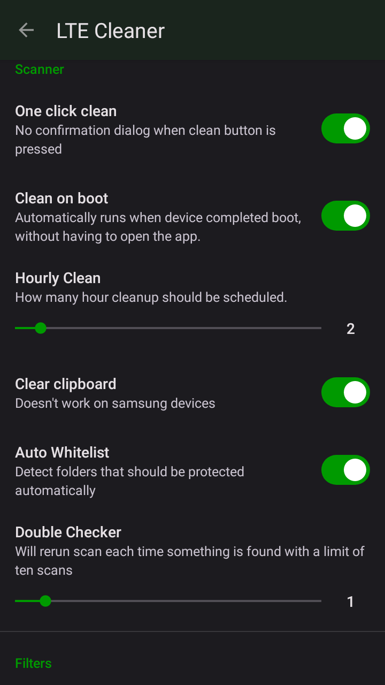
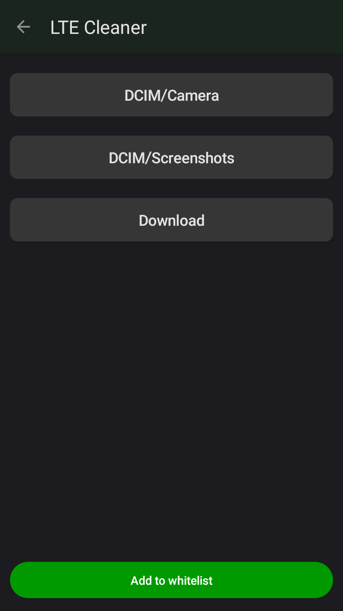

<details><summary>Important notice about original version</summary>
So I forked LTE Cleaner, that was originally developed by @TheRedSpy15 because
the app has been permanently banned from Play Store at 4 April 2023 due to a screenshot that apparently "deceived" users.
This project initially started as a learning opportunity for @TheRedSpy15 back in 2018 when he was in 10th grade.
After putting ads on the Play Store variant, it becomes a source of monthly income to cover his student debt bill while he was in college.
As a result, @TheRedSpy15 has given up on the project and is unable to continue supporting the F-Droid variant without some compensation.
You can read more in here: https://github.com/TheRedSpy15/LTECleanerFOSS.
Despite hitting 100k users, he is no longer able to devote time to it. Thank you for your support.
</details>

## LTECleanerFOSS


[](/issues)
[](/blob/master/LICENSE)

***The last Android cleaner you will ever need!***

Tired of the abundance of phone cleaners on the Play Store? Tired of
them being extremely shady? Tired of them doing nothing? Tired of ads?
Tired of having to pay? Me too.

There are simply way too many apps out there that claim to "speed up your device". In reality, they don't do anything.
LTE Cleaner only aims to clean your phone by removing safe to delete files, which not only frees up a lot of space, but also improve your privacy. Since LTE Cleaner removes .log files, which well, log what you do.

__LTE Cleaner is 100% free, open source, no ads, and deletes everything it claims to.__

## Install
[GitHub](https://github.com/MDP43140/LTECleanerFOSS/files/13996640/app-release.zip)
[Build it yourself](#compiling-the-app)
[Original F-Droid (outdated)](https://f-droid.org/packages/theredspy15.ltecleanerfoss)
[Original source code (outdated)](https://github.com/theredspy15/LTECleanerFOSS)

## Features
- Clipboard clearing
- Whitelist
- Daily cleanup

Cleans:
- Empty folders
- Logs
- Temporary files
- Caches
- Advertisement folders

To do list (not guaranteed because i'm busy irl):
- Code cleanups
- Clean SD card (has to support minimal Android 10+, hopefully we can use StorageAccessFramework to make this work, but it might be a huge work that can take days, not possible with my spare time)
- Custom (regex) blacklist (In theory should be simple, just need to add additional rule matching to cleaning system, but implementing the separate Activity might be a bit painful)
- Regex whilelist
- About screen (designing the UI would be really painful, and using external dependency will also significantly enlarge file size)
- Root cleanups
<!-- Scan then clean, instead of doing both at the same time (atleast on some devices that i tested on, it lags when there is so many files)-->

## Screenshots




## The Team
<a href="https://github.com/mdp43140/LTECleanerFOSS/graphs/contributors">
  
</a>

Contribute to this project:
- Test the app with different devices
- Report issues and feature requests in the [issue tracker](https://github.com/mdp43140/LTECleanerFOSS/issues)
- Create a [Pull Request](https://opensource.guide/how-to-contribute/#opening-a-pull-request)
- Translate this app into more languages

## Compiling the app
Just go to the project root directory, and run this command: ```./gradlew assembleRelease``` (if you're using Windows, change `./gradlew` to `gradlew.bat`)

## License
[](https://www.gnu.org/licenses/gpl-3.0.en.html)

LTE Cleaner is Free Software: You can use, study, share, and improve it at
will. Specifically you can redistribute and/or modify it under the terms of the
[GNU General Public License](https://www.gnu.org/licenses/gpl.html) as
published by the Free Software Foundation, either version 3 of the License, or
(at your option) any later version.
